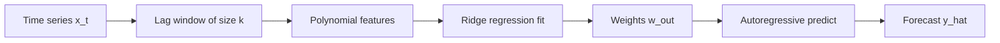

# NGRC — Next Generation Reservoir Computing

A Python implementation of **NGRC** (Next Generation Reservoir Computing) for **time series forecasting**. The model builds polynomial features from lagged observations, fits output weights with ridge-regularized least squares, and forecasts autoregressively on held-out data.

The main logic lives in `code.py`: class `NGRC` plus an example pipeline on the Mackey–Glass time series.

---

## Requirements

Install dependencies (Python 3.8+ recommended):

```bash
pip install numpy pandas matplotlib scipy scikit-learn openpyxl
```

| Package | Role |
|---------|------|
| `numpy`, `pandas` | Arrays and data loading |
| `scikit-learn` | `PolynomialFeatures`, `BaseEstimator`, `mean_squared_error` |
| `scipy` | Linear algebra (`linalg.inv`) for the closed-form fit |
| `matplotlib` | Plotting (imported; optional for the demo) |
| `openpyxl` | Reading `.xlsx` files in the example |

---

## Quick start

1. Place your time series data in a spreadsheet (or adapt the loader in `code.py`).
2. Update the file path in `code.py` (see [Example script](#example-script-at-the-bottom-of-codepy)).
3. Run:

```bash
python code.py
```

The script trains on the first 700 points, predicts the next 10 steps, prints predictions and MSE.

---

## How it works (overview)



1. **Features** — At each time step, take `k` past values (with optional spacing `s`) and expand them with a polynomial basis of degree `deg`.
2. **Training** — Standardize features, then solve for output weights `w_out` that map features to the target `y` (next-step values) with L2 regularization `reg`.
3. **Prediction** — For each future step, build features from the current window, apply `w_out`, append the prediction to the window, and repeat (autoregressive rollout).

---

## Class `NGRC`

`NGRC` subclasses scikit-learn’s `BaseEstimator` and `RegressorMixin`, so it follows the familiar `fit` / `predict` API.

### Constructor parameters

| Parameter | Default | Meaning |
|-----------|---------|---------|
| `k` | `4` | Number of lagged time steps used as input |
| `s` | `1` | Step between lags: lag `i` uses `data[t - i*s]` |
| `deg` | `3` | Polynomial degree for feature expansion |
| `reg` | `1e-6` | Ridge regularization strength (added to `X X^T`) |
| `test_len` | `10` | Number of steps to forecast in `predict()` |

### `build_features(data)`

Builds the design matrix used for training.

- **Input:** `data` — shape `(N, 1)`, one-dimensional series as a column vector.
- **Process:** For each time index `t` from `k` to `N-1`:
  - Collect lag vector `O_lin = [x_t, x_{t-s}, x_{t-2s}, …, x_{t-(k-1)s}]`.
  - Apply `PolynomialFeatures(degree=deg)` to get all monomial combinations of those `k` lags.
- **Output:** Matrix of shape `(num_features, N - k)` where `num_features = C(k + deg, deg)` (combinations with replacement).

### `fit(data, y_data)`

Learns output weights `w_out`.

- **Targets:** `y_data[k:]` aligned with each feature column (one-step-ahead style targets).
- **Normalization:** Per-feature mean `f_mean` and std `f_std` (with `1e-8` floor on std) are stored for use at prediction time.
- **Weights:** Closed-form ridge solution:

  \[
  W = Y X^T (X X^T + \lambda I)^{-1}
  \]

  where `X` is the standardized feature matrix, `Y` is the target row vector, and `λ` is `reg`.

### `predict(test_data)`

Autoregressive multi-step forecast.

- **Input:** Last `k` (or more) normalized observations; the implementation uses the last `k` values from `test_data` to seed the window.
- **Loop:** For `test_len` steps:
  - Build polynomial features from the current `k`-length window (same lag rule as training).
  - Standardize with `f_mean` / `f_std`.
  - `y = w_out @ x`, append `y` to the window (shift window forward).
- **Output:** 1D array of length `test_len` with predicted values (still in normalized scale if training data was normalized).

---

## Example script (bottom of `code.py`)

The block after the class is a **Mackey–Glass** demo:

1. **Load data** from an Excel file with columns `t` (current) and `t+1` (next step).
2. **Slice** rows `100:1050` and drop an unnamed index column.
3. **Normalize** `t` and `t+1` separately (zero mean, unit variance).
4. **Train** on indices `0:700` with `k=10`, `deg=3`, `reg=1e-4`.
5. **Test** on steps `700:710`: seed `predict` with `data[690:700]`, compare to original-scale targets.
6. **Metrics** — Inverse-transform predictions and compute `mean_squared_error` vs `o_y_data[700:710]`.

### Data path

Change this line to your dataset:

```python
dataa = pd.read_excel('/path/to/your/Mackey-Glass Time Series.xlsx')
```

Expected columns:

- `t` — input series (current time)
- `t+1` — one-step-ahead target (used as `y_data`)

### Typical usage pattern

```python
import numpy as np
from code import NGRC  # or: from your_module import NGRC after splitting the file

# x: (N, 1) normalized series; y: (N,) targets (e.g. next-step)
model = NGRC(k=10, s=1, deg=3, reg=1e-4, test_len=10)
model.fit(train_x, train_y)

seed = train_x[-model.k:]  # last k points as column vector
forecast = model.predict(seed.copy())

# If you normalized y during training, denormalize:
# forecast_orig = forecast * y_std + y_mean
```

---

## Tuning tips

| Knob | Effect |
|------|--------|
| Larger `k` | More memory in the input window; more features if `deg` is high |
| Larger `deg` | Richer nonlinear features; risk of overfitting — increase `reg` |
| Larger `reg` | Smoother weights, less overfitting |
| `s > 1` | Wider temporal spacing between lags (subsampling the past) |

Train/validation split should leave at least `k` points before the test segment so `predict` has a valid initial window.

---

## Project layout

```
NGRC/
├── code.py    # NGRC class + Mackey–Glass example
└── README.md  # This file
```

---

## Notes and limitations

- The example uses a **fixed absolute path** to an Excel file; portable workflows should use a relative path or CLI argument.
- `predict` **mutates the rolling window** internally via `np.vstack`; pass a copy of the seed window if you need the original array unchanged.
- Feature count grows quickly as `deg` and `k` increase (`math.comb(k + deg, deg)`), which affects memory and the size of the matrix inverse in `fit`.
- For production use, consider moving the class into a module (e.g. `ngrc.py`) and keeping only CLI or notebook code in a separate script.

---

## References

NGRC belongs to the reservoir computing family for dynamical systems and chaotic time series prediction. The Mackey–Glass series is a standard benchmark for delay-based chaotic forecasting methods.
