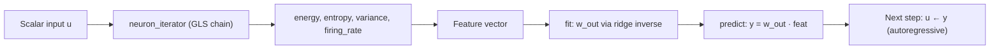

# NLRC Feature Extraction

This directory contains two closely related implementations of **nonlinear feature extraction + ridge readout** for chaotic time-series forecasting. Both scripts share the same core class name (`nlfea`), the same **GLS-style neuron map**, the same **statistical feature block** (energy, entropy, variance, firing rate), and the same **closed-form ridge regression** training rule. They differ in whether the readout sees only **instantaneous** features or **delay-embedded, polynomial-expanded** features—the second path is structurally close to **NGRC** (Next Generation Reservoir Computing).

| Script | Role |
|--------|------|
| [`feature_only.py`](feature_only.py) | Extract GLS + statistics per time step; linear readout on a **6-dimensional** feature vector. |
| [`feature_polynomial.py`](feature_polynomial.py) | Same extraction over a **delay window**, then **polynomial expansion** of the concatenated linear features; readout on the expanded space. |

Each file is self-contained: it defines `nlfea`, generates demo data, trains, predicts recursively, prints MSE, and plots a scatter of successive predictions.

---

## Shared architecture

Both pipelines follow the same high-level pattern used elsewhere in this repository (e.g. `base_version`, `leaky_NLRC`): **nonlinear feature construction** → **ridge least squares** → **autoregressive prediction**.



### 1. GLS neuron map (`neuron_gen`, `neuron_iterator`)

For a scalar input `u` (clipped to `[1e-8, 1 - 1e-8]`):

- If `u >= b` (threshold, default `0.5`): return `(1 - u) / (1 - b)`.
- Else: return `u / b`.

`neuron_iterator(u)` builds a chain of length `n` (default `10`):

- `X[0] = u`
- `X[j+1] = neuron_gen(X[j])` for `j = 0 … n-2`

This is the same piecewise nonlinearity as in the base NLRC implementations: one scalar is unfolded into an `n`-dimensional internal state without an external recurrent reservoir.

### 2. Statistical features (from the GLS chain)

From the vector `X` produced by `neuron_iterator`:

| Feature | Method | Meaning |
|---------|--------|---------|
| **Energy** | `mean(X²)` | Average squared activation along the chain. |
| **Entropy** | Binary spike train at threshold `b`, then Shannon entropy in bits | Coarse “information” in on/off patterns along the chain. |
| **Variance** | `var(X)` | Spread of activations across iterations. |
| **Firing rate** | Fraction of `X` values above `b` | Fraction of “active” neurons in the chain. |

`ss_to_binary` thresholds the chain at `b` before entropy is computed. Empty chains return `0` for energy, variance, and entropy.

### 3. Ridge readout (`fit`)

Training targets `y_data` are shaped as a row vector `yt` of length `T`. Feature matrix `history_x` has shape `(F, T)` where `F` is the feature dimension and each **column** is one time step.

Weights are solved in closed form (Tikhonov / ridge on the feature covariance):

```text
w_out = yt @ history_x.T @ inv(history_x @ history_x.T + reg * I)
```

- **`reg`** (default `1e-8`): stabilizes the inverse when features are collinear or numerous (especially important after polynomial expansion).
- **`w_out`**: row vector of length `F`; prediction is `y = w_out @ feat`.

### 4. Recursive prediction (`predict`)

Both models forecast **`test_len`** steps ahead in an **autoregressive** loop:

1. Build features from the current input (and delay buffer in the polynomial variant).
2. `y = w_out @ features`.
3. Use `y` as the input for the next step (and update the delay buffer where applicable).

Training uses **one-step-ahead** pairs `(x_t, x_{t+1})` after scaling; testing feeds the model its own outputs, so error can grow over long horizons (as in the base NLRC README).

### 5. Demo driver (bottom of each file)

Common steps in the `if __name__`-style block at the end:

1. Generate series (`test_data` logistic map or `mackey_glass`).
2. Split train / test windows; build `y_train`, `y_test` as one-step-ahead targets.
3. **`MinMaxScaler`** on inputs and training targets to `[0, 1]`.
4. `model.fit(...)` then `model.predict(...)`.
5. **Inverse transform** predictions with the same scaler used on `y_train`.
6. Print MSE; scatter plot of `y_pred[t]` vs `y_pred[t+1]` (phase-space view of the rollout).

---

## `feature_only.py` — instantaneous features

### Idea

At each training time index, only the **current** normalized sample `u = data[i]` is passed through the GLS chain. The readout sees a **fixed 6-dimensional** feature vector:

```text
[1, u, energy, entropy, variance, firing_rate]
```

There is **no delay embedding** and **no polynomial lift**. This is the minimal “feature extraction only” variant: all nonlinearity enters through `neuron_iterator` and the statistics, not through explicit products of delayed inputs.

### `build_features(self, data)`

- Output shape: `(6, len(data))`.
- Per index `i`: `u = data[i]` → `x = neuron_iterator(u)` → stack bias, `u`, and four statistics.

### `fit` / `predict`

- **`fit(data, y_data)`**: `history_x = build_features(data)`; ridge with `6×6` regularized Gram matrix.
- **`predict(u)`**: starts from first test value `X_test[0]`; each step rebuilds the 6-vector from the current `u` and applies `w_out`; then `u ← y` for the next iteration.

### Default demo settings

- Data: **Mackey–Glass** (`mackey_glass()`, slice after transient).
- `train_len = 1000`, `test_len = 10`.
- `nlfea(n=10, test_len=10, b=0.5)`.

### When to use

- Smallest feature space; fastest training and prediction.
- Good baseline to see how much forecast quality comes from the GLS + statistics block alone.
- Pairs naturally with longer train windows on smooth/delay dynamics (Mackey–Glass in the bundled demo).

---

## `feature_polynomial.py` — delay embedding + polynomial expansion (NGRC-like)

### Idea

This variant adds two mechanisms that align with **NGRC-style** pipelines:

1. **Delay (Takens-style) embedding** of length `k`: each feature vector depends on the current value **and** the previous `k` values (maintained in a sliding buffer).
2. **Polynomial feature map** (`sklearn.preprocessing.PolynomialFeatures`) applied to a **concatenated linear descriptor** built from every point in that window.

The readout is still **linear in the expanded features**, but the expansion provides explicit monomials of delayed inputs and their statistics—similar in spirit to NGRC, where a polynomial basis of (often delay-embedded) inputs replaces a large random reservoir.

### Linear block before expansion

For each time step, define `search_span` as the concatenation of the delay buffer and the current scalar:

```text
search_span = [x_{t-k}, …, x_{t-1}, x_t]   # length k+1
```

For **each** scalar `u_j` in `search_span`:

1. Run `neuron_iterator(u_j)`.
2. Compute energy, entropy, variance, firing rate.
3. Pack into five slots: `[u_j, energy, entropy, variance, firing_rate]`.

Stack all windows in order into a **linear** vector of length:

```text
5 * (k + 1)
```

Example: `k = 3` → four time points → **20** linear components.

### Polynomial expansion (detailed)

After the linear vector `lin ∈ R^{5(k+1)}` is built:

```python
poly_feat = PolynomialFeatures(degree=deg).transform(lin.reshape(1, -1))
```

**What `PolynomialFeatures` does (default `include_bias=True`):**

- Emits the constant term `1`.
- Emits every **original** linear coordinate (degree-1 terms).
- Emits every **product** of distinct coordinates whose total degree is ≤ `deg` (e.g. for `deg=2`, all pairs `lin_i * lin_j` with `i ≤ j`).

So the readout dimension grows combinatorially with `deg` and with `5(k+1)`. A dummy fit on `np.zeros(5*(k+1))` at the start of `build_features` sets `self.feat_size` so `history_x` can be preallocated.

**Why this is close to NGRC:**

| NGRC concept | This implementation |
|--------------|---------------------|
| Finite-dimensional nonlinear basis of inputs | `PolynomialFeatures` on delay-embedded GLS/statistics |
| No large random reservoir | Nonlinearity from GLS chain + explicit monomials |
| Linear trainable readout | Same ridge formula on expanded columns |
| Delay memory for forecasting | Explicit buffer `delay_X_train` / `delay_X_test` of length `k` |

NGRC in the literature often expands **raw delayed inputs** with polynomials; here the polynomial is applied to **richer coordinates** (each delay tap already carries `u` and four statistics from a GLS chain). That hybridizes reservoir-style feature construction with NGRC-style explicit products.

### Delay buffer update

During training (`build_features`):

- Initialize `delay_X_train` from data **before** the train segment (caller passes `data[:k]`).
- After each column is written, slide the buffer: drop oldest, append `data[i]`.

During prediction (`predict(u, delay_X_test)`):

- Same `search_span` construction from `delay_buffer` and current `u`.
- After each predicted `y`, append `y` to the buffer and set `u = y` for autoregression.

### Extra hyperparameters

| Parameter | Default | Role |
|-----------|---------|------|
| **`k`** | `3` in demo | Number of past samples in the delay line (window length `k+1`). |
| **`degree`** | `2` in demo | Maximum total degree of polynomial terms on the linear block. |

Larger `k` or `degree` increases `feat_size` sharply; increase **`reg`** if the Gram matrix becomes ill-conditioned.

### Default demo settings

- Data: **logistic map** (`test_data()`).
- `train_len = 100`, `test_len = 10`, `k = 3`, `degree = 2`.
- Delay slices: `delay_X_train = data[:k]`, `delay_X_test` aligned to the test window.
- `nlfea(test_len=test_len, degree=2, k=3)`.

### When to use

- When you need **explicit memory of past inputs** without a separate leaky integrator (cf. `leaky_NLRC`).
- When you want **NGRC-like** expressive power in the feature space while keeping training as a single ridge solve.
- Expect higher MSE sensitivity to `degree`, `k`, and `reg`; tune on validation before long rollouts.

---

## Side-by-side comparison

| Aspect | `feature_only.py` | `feature_polynomial.py` |
|--------|-------------------|---------------------------|
| Feature dim `F` | Fixed **6** | `PolynomialFeatures(degree).n_output_features_` on `5(k+1)` inputs |
| Temporal context | Current `u` only | Delay window length `k+1` |
| Nonlinearity in features | GLS + statistics | GLS + statistics + **cross-terms** across delays/stats |
| `build_features` signature | `(data)` | `(data, delay_X_train)` |
| `predict` signature | `(u)` | `(u, delay_X_test)` |
| Ridge matrix size | `6 × 6` | `feat_size × feat_size` |
| Bundled dataset | Mackey–Glass | Logistic map |

---

## Dependencies

- `numpy`
- `scipy` (`linalg.inv` for ridge)
- `scikit-learn` (`MinMaxScaler`, `PolynomialFeatures`, `mean_squared_error`)
- `matplotlib` (demo plot)

Install example:

```bash
pip install numpy scipy scikit-learn matplotlib
```

---

## How to run

From this directory:

```bash
python feature_only.py
python feature_polynomial.py
```

Each script prints `mse is <value>` and opens a scatter plot. Adjust hyperparameters and data generators at the bottom of the respective file.

### Using the class in your own code

**Feature-only:**

```python
from feature_only import nlfea  # or run as script and import nlfea from module

model = nlfea(n=10, b=0.5, test_len=10, reg=1e-8)
model.fit(X_train, y_train)
y_pred = model.predict(X_test[0].item())
```

**Polynomial + delay:**

```python
from feature_polynomial import nlfea

model = nlfea(k=3, degree=2, n=10, test_len=10, reg=1e-8)
model.fit(X_train, y_train)  # uses internal delay_X_train from build_features call
# Caller must pass delay buffer consistent with training:
y_pred = model.predict(X_test[0].item(), delay_X_test)
```

Always apply the same `MinMaxScaler` fit on training inputs/targets and inverse-transform predictions before computing MSE in original units.

---

## Hyperparameters (`nlfea.__init__`)

| Parameter | Default | Used in |
|-----------|---------|---------|
| `b` | `0.5` | GLS threshold; binary encoding for entropy and firing rate |
| `n` | `10` | GLS chain length |
| `test_len` | `10` | Autoregressive forecast horizon |
| `reg` | `1e-8` | Ridge regularization on `history_x @ history_x.T` |
| `k` | `3` | **Polynomial only**: delay embedding length |
| `degree` | `3` (constructor) / `2` (demo) | **Polynomial only**: max polynomial degree |

---

## Data helpers

Both files define:

- **`test_data(a, i, length)`** — logistic map \(x_{t+1} = a x_t (1 - x_t)\).
- **`mackey_glass(...)`** — Mackey–Glass delay differential equation, Euler integration; returns series after dropping an initial transient segment.

Swap the `data = ...` line and window indices in the demo block to benchmark either script on the same series.

---

## Relation to other NLRC folders

- **`base_version`**: Full NLRC with GLS features stacked as `[1, X₀, …, Xₙ₋₁]` (chain values in the readout, not only statistics).
- **`leaky_NLRC`**: Adds a **leaky exponential memory** over feature columns instead of delay embedding + polynomials.
- **This directory**: Focuses on **hand-crafted statistics** from the GLS chain; the polynomial script adds an **NGRC-like explicit basis** on top of delay-rich linear descriptors.

Together, these variants isolate how much forecasting performance comes from (1) the neuron map, (2) statistical summaries, (3) temporal embedding, and (4) polynomial lifting of the feature vector.
