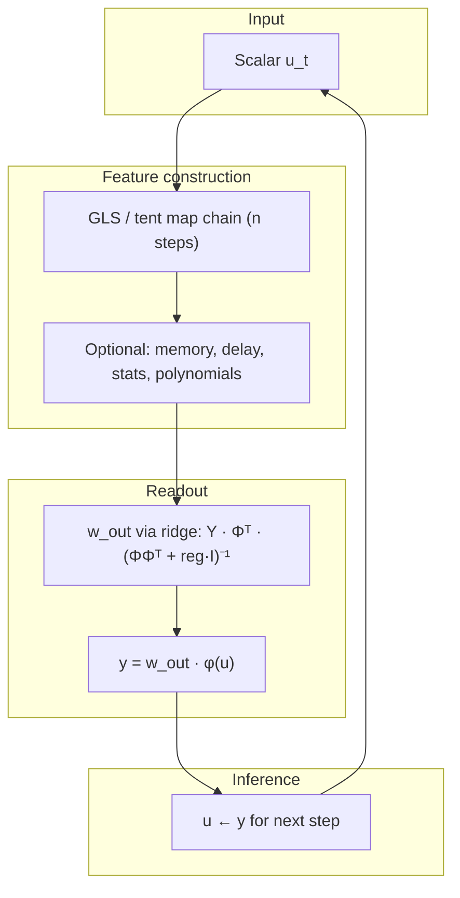

# NLRC — Neurochaos learning-Reservoir Computing for Time Series

This repository collects experiments on **chaotic time-series forecasting** using lightweight reservoir-style models. All variants share the same core idea: expand each scalar input through a **piecewise tent / GLS neuron map**, train a **ridge-regression readout** in closed form, then forecast **autoregressively** (each prediction becomes the next input).

Benchmarks include the **Mackey–Glass** delay equation and the **logistic map**. Most NLRC scripts scale data with `MinMaxScaler` to `[0, 1]` before training.

---

## Architecture (shared pattern)



| Stage | What it does |
|--------|----------------|
| **GLS neuron** | Threshold `b` (default `0.5`): if `x ≥ b` then `(1−x)/(1−b)`, else `x/b`. Chained `n` times on one scalar. |
| **Features** | Bias plus chain values, statistics, delay windows, or leaky integration—depends on folder. |
| **Training** | One-step-ahead pairs `(x_t, x_{t+1})`; features stored as columns of matrix `Φ`. |
| **Prediction** | Seed with first test value; roll forward `test_len` steps using only model outputs. |

---

## Repository layout

| Folder | Class / style | Main idea |
|--------|----------------|-----------|
| [`base_version/`](base_version/) | `nlrc` | Baseline NLRC: GLS chain → `[1, X₀, …, Xₙ₋₁]` → ridge readout. Demo: Mackey–Glass. |
| [`leaky_NLRC/`](leaky_NLRC/) | `nlrc` | Same GLS features + **leaky exponential memory** over training time (`memory_constructor`). |
| [`NLRC_feature_extraction/`](NLRC_feature_extraction/) | `nlfea` | GLS chain summarized by **energy, entropy, variance, firing rate**; optional delay + polynomial lift (NGRC-like). |
| [`RC_tentmap_functionchange/`](RC_tentmap_functionchange/) | Script-only ESN | Classic **Echo State Network** (300 units) on Mackey–Glass; replaces `tanh` with **sigmoid → tent map**. |

Each subdirectory has its own `README.md` with hyperparameters, API notes, and design detail.

---

## Variant comparison

| | Feature size | Temporal memory | Nonlinearity |
|--|--------------|-----------------|--------------|
| **base_version** | `n + 1` (~11) | None (instantaneous chain) | GLS iterations |
| **leaky_NLRC** | `n + 1` | Leak factor `a` (EMA over feature columns) | GLS + leaky integrator |
| **feature_only** | 6 | Current sample only | GLS + statistics |
| **feature_polynomial** | Polynomial of `5(k+1)` terms | Delay window length `k` | GLS + stats + `PolynomialFeatures` |
| **RC_tentmap** | `1 + insize + ressize` (301) | Recurrent reservoir state `x` | Random `W`, sigmoid, tent map |

**NLRC** models avoid a large random recurrent matrix; **RC_tentmap** is a full ESN kept for comparison with the same tent-shaped activation used in GLS maps.

---

## Code map

### `base_version/code.py`

- **`nlrc`**: `gls_neuron_gen`, `build_features`, `fit`, `predict`
- Helpers: `mackey_glass`, `test_data`
- End-to-end train / MSE / plot on scaled Mackey–Glass

### `leaky_NLRC/code.py`

- Extends base with **`memory_constructor`** (train) and **`memory_constructor_pred`** (test)
- Hyperparameter **`a`**: leak in `[0, 1]` (`a → 0` ≈ memoryless NLRC)

### `NLRC_feature_extraction/`

| File | Role |
|------|------|
| `feature_only.py` | 6-D features: `[1, u, energy, entropy, variance, firing_rate]` |
| `feature_polynomial.py` | Delay embedding (`k`) + `PolynomialFeatures(degree)` on stacked per-lag statistics |

### `RC_tentmap_functionchange/code.py`

- Random `W`, `W_in`; spectral radius scaling
- Update: `pre = W·x + W_in·[1;u]` → `sigmoid` → `tentmap` → leaky `x`
- Ridge readout on `[1; u; x]`; same Mackey–Glass lengths as classic RC demos

---

## Dependencies

```
numpy, scipy, scikit-learn, matplotlib
```

(`RC_tentmap_functionchange/code.py` also imports `pandas` but does not use it in the current script.)

Install:

```bash
pip install numpy scipy scikit-learn matplotlib
```

---

## Quick start

From the repo root:

```bash
python base_version/code.py
python leaky_NLRC/code.py
python NLRC_feature_extraction/feature_only.py
python NLRC_feature_extraction/feature_polynomial.py
python RC_tentmap_functionchange/code.py
```

Each script prints MSE (where applicable) and may open a matplotlib figure.

---

## Design notes

1. **No spatial neighborhood** — depth is controlled by iteration count `n` on a scalar, not a grid of neurons.
2. **Recursive testing** — only the first test point (or trained reservoir state) seeds the rollout; ground-truth inputs are not fed step-by-step during `predict`.
3. **Tent map consistency** — the GLS map in NLRC matches `tentmap()` in the RC script (threshold `b = 0.5`), linking the lightweight and ESN experiments.

For per-folder metrics, plots, and parameter tables, see the README in each directory.
