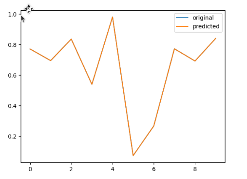

# NLRC Time-Series Prediction (`code.py`)

This script trains an **NLRC** (Nonlinear Reservoir Computing) model on a Mackey–Glass time series, predicts the next segment recursively, and plots predicted vs. actual values.

## Results

| Metric | Value |
|--------|-------|
| **Final MSE** | ~`4.15e-10` |

The plot below compares the first 10 test targets (**original**, blue) with model outputs (**predicted**, orange). The two curves overlap almost exactly, matching the very low MSE above.



---

## Dependencies

- `numpy` — arrays and linear algebra
- `scipy.linalg` — matrix inverse for ridge regression
- `sklearn.preprocessing.MinMaxScaler` — scale inputs/targets to `[0, 1]`
- `sklearn.metrics.mean_squared_error` — evaluation
- `matplotlib.pyplot` — plot and legend

---

## `nlrc` class

### `__init__(self, b=0.5, reg=1e-8, n=10, test_len=10)`

Stores hyperparameters:

- **`b`** — threshold for the GLS neuron map (default `0.5`)
- **`reg`** — ridge regularization added to `history_x @ history_x.T` (default `1e-8`)
- **`n`** — number of GLS iterations / feature dimension (default `10`)
- **`test_len`** — how many recursive prediction steps to run (default `10`)

### `gls_neuron_gen(self, x)`

Maps a scalar `x` through a piecewise GLS-style nonlinearity:

1. Clips `x` to `[1e-8, 1 - 1e-8]` so divisions stay stable.
2. If `x >= b`: returns `(1 - x) / (1 - b)`.
3. Else: returns `x / b`.

Used repeatedly to turn one input value into a chain of `n` transformed features (no spatial neighborhood—only iteration count `n`).

### `build_features(self, data)`

For each time index `i` in `data`:

1. Takes the current value `u = data[i]`.
2. Builds vector `X` of length `n` with `X[0] = u` (using `.item()` so scalars are floats, not 0-d arrays).
3. For `j = 0 … n-2`, sets `X[j+1] = gls_neuron_gen(X[j])`.
4. Stacks bias `1` with `X` into one column: `np.vstack((1, X.reshape(-1, 1))).flatten()` → length `n + 1`.

Returns **`history_x`** with shape `(n + 1, len(data))`: each column is the feature vector for that time step.

### `fit(self, data, y_data)`

1. Reshapes `y_data` to row vector `yt` with shape `(1, train_len)`.
2. Calls `build_features(data)` → `history_x`.
3. Computes readout weights (ridge least squares):

   ```text
   w_out = yt @ history_x.T @ inv(history_x @ history_x.T + I * reg)
   ```

   `w_out` has shape `(1, n + 1)` and is stored on `self`.

Returns `self` for chaining.

### `predict(self, test_u)`

Recursive one-step-ahead forecasting for `test_len` steps:

1. Starts with scalar seed `u = test_u` (first scaled test point).
2. For each step `i`:
   - Builds `X` from `u` via the same `n`-step GLS chain as in `build_features`.
   - Forms feature `[1; X]` and computes `y = w_out @ feature`.
   - Stores `y` in `Y[:, i]`.
   - Sets **`u = y.item()`** so the **previous prediction** feeds the next step (recursive / autoregressive rollout).

Returns flattened predictions of length `test_len`.

---

## Data helpers

### `test_data(a=3.95, i=0.5422, length=1000)`

Generates a logistic map series: `x[0] = i`, then `x[t+1] = a * x[t] * (1 - x[t])`. Not used in the main script (Mackey–Glass is used instead).

### `mackey_glass(length=2000, tau=17, beta=0.2, gamma=0.1, n=10, dt=1.0)`

Integrates the Mackey–Glass delay differential equation by Euler steps:

- Initializes `x[:tau+1] = 1.2`.
- For `t` from `tau` to `length - 2`, updates using delayed term `x[t - tau]` and current `x[t]`.

Returns the full series `x` (length `2000` by default).

---

## Main script flow

1. **Generate data:** `data = mackey_glass()`.
2. **Splits:**
   - `train_len = 100`, `test_len = 100`, `p = 0` (no gap between train and test).
   - `train_X = data[:100]`, `test_X = data[100:200]`.
   - `train_y = data[1:101]` (one-step-ahead targets for training).
   - `test_y = data[101:201]` (ground truth for evaluation; **not** passed into `predict` for rollout).
3. **Scaling:** `MinMaxScaler(0, 1)` fit on `train_X`; transform `train_X`, `train_y`, and `test_X`. `test_y` stays in original scale for MSE/plot after inverse transform of predictions.
4. **Train:** `model = nlrc(test_len=test_len, n=10)` then `model.fit(train_X, train_y)`.
5. **Predict:** `y_pred = model.predict(test_X[0].item())` — only the **first** scaled test value seeds recursion; remaining test inputs are not fed step-by-step.
6. **Inverse scale:** `y_pred` mapped back with `scalar.inverse_transform`.
7. **Evaluate:** `mse = mean_squared_error(test_y, y_pred)` (~`4.15e-10`).
8. **Plot:** `plt.plot(test_y)` and `plt.plot(y_pred)` with legend `original` / `predicted`, then `plt.show()`.

---

## File layout

| File | Role |
|------|------|
| `code.py` | Model, data generation, training, prediction, MSE, plot |
| `predicted_vs_actual.png` | Predicted vs. actual curve for the test segment |
| `read.md` | This documentation |
